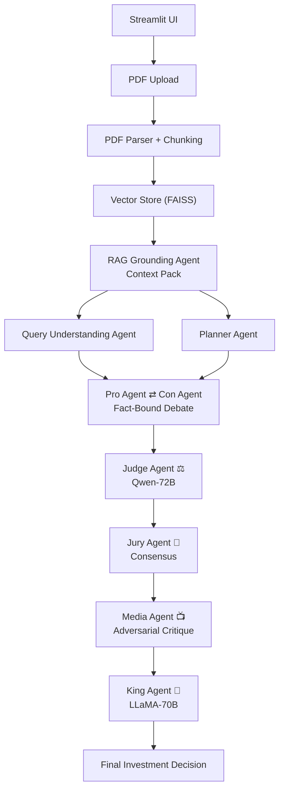

# ⚖️ Agentic Investment Courtroom

A **12-Agent Investment Analysis System** with RAG-grounded courtroom debate, adversarial critique, and consensus-based decision making.

## 🎯 Overview

This system uses a multi-agent architecture to analyze investment opportunities from uploaded PDF documents. Rather than providing a simple yes/no answer, it simulates a courtroom where:

- **Pro Agent** argues the bull case
- **Con Agent** argues the bear case  
- **Judge Agent** evaluates the evidence
- **Jury Agent** builds consensus
- **Media Agent** provides adversarial critique
- **King Agent** delivers the final verdict

## 🏗️ Architecture

```
┌──────────────────────────────────────────────────────────┐
│                  STREAMLIT UI (VS CODE)                  │
│  - Upload PDFs                                           │
│  - Ask Investment Question                               │
└──────────────────────────────┬───────────────────────────┘
                               │
                               ▼
┌──────────────────────────────────────────────────────────┐
│                 DOCUMENT INGESTION LAYER                 │
│  PDF Parser (PyPDF)                                      │
│  - Text Extraction                                       │
│  - Semantic Chunking                                     │
└──────────────────────────────┬───────────────────────────┘
                               │
                               ▼
┌──────────────────────────────────────────────────────────┐
│                    RAG BACKBONE                          │
│  Embeddings (HuggingFace all-MiniLM-L6-v2)              │
│  Vector Store (FAISS)                                    │
└──────────────────────────────┬───────────────────────────┘
                               │
                               ▼
┌──────────────────────────────────────────────────────────┐
│              RAG GROUNDING AGENT (WOMB)                  │
│  - Retrieves relevant facts                              │
│  - Filters noise                                         │
│  - Produces CONTEXT PACK                                 │
│                                                          │
│  ❗ ONLY SOURCE OF TRUTH FOR ALL AGENTS                  │
└──────────────────────────────┬───────────────────────────┘
                               │
          ┌────────────────────┴─────────────────────┐
          │                                          │
          ▼                                          ▼
┌───────────────────────┐               ┌───────────────────────┐
│ Query Understanding   │               │ Planner Agent         │
│ - Intent              │               │ - Analysis Plan       │
│ - Horizon             │               │ - Feasible Steps      │
└──────────────┬────────┘               └──────────────┬────────┘
               │                                       │
               └──────────────┬────────────────────────┘
                              ▼
┌──────────────────────────────────────────────────────────┐
│                 ORCHESTRATED DEBATE                      │
│                                                          │
│  ┌───────────────┐        ┌───────────────┐             │
│  │   PRO AGENT   │  ⇄     │   CON AGENT   │             │
│  │ (Bull Case)   │        │ (Bear Case)   │             │
│  └───────────────┘        └───────────────┘             │
│                                                          │
│  Rules:                                                  │
│  - Facts only                                           │
│  - Context-bound                                        │
│  - No speculation                                       │
└──────────────────────────────┬───────────────────────────┘
                               │
                               ▼
┌──────────────────────────────────────────────────────────┐
│                 JUDGE AGENT ⚖️                           │
│  LLM: Qwen-72B                                           │
│  - Scores evidence                                       │
│  - Evaluates asymmetry                                   │
│  - NO final decision                                     │
└──────────────────────────────┬───────────────────────────┘
                               │
                               ▼
┌──────────────────────────────────────────────────────────┐
│                 JURY AGENT 👥                            │
│  - Multiple stochastic votes                             │
│  - Consensus building                                    │
└──────────────────────────────┬───────────────────────────┘
                               │
                               ▼
┌──────────────────────────────────────────────────────────┐
│              MEDIA AGENT (RL CRITIQUE) 📺                │
│  - Simulates analyst/media backlash                      │
│  - Stress-tests narrative                                │
└──────────────────────────────┬───────────────────────────┘
                               │
                               ▼
┌──────────────────────────────────────────────────────────┐
│                 KING AGENT 👑                            │
│  LLM: LLaMA-70B (DIFFERENT FROM JUDGE)                   │
│  - Critiques Judge                                       │
│  - Weighs Jury                                           │
│  - Incorporates Media pressure                           │
│                                                          │
│  ✅ FINAL VERDICT                                        │
│  - Invest / Hold / Avoid                                 │
│  - Position sizing                                       │
│  - Conditions                                            │
└──────────────────────────────────────────────────────────┘
```

### Mermaid Flow Diagram


```mermaid
flowchart TD
    UI["Streamlit UI"] --> PDF["PDF Upload"]
    PDF --> PARSER["PDF Parser + Chunking"]
    PARSER --> VSTORE["Vector Store (FAISS)"]
    VSTORE --> RAG["RAG Grounding Agent<br/>Context Pack"]

    RAG --> QUERY["Query Understanding Agent"]
    RAG --> PLANNER["Planner Agent"]

    QUERY --> DEBATE
    PLANNER --> DEBATE

    DEBATE["Pro Agent ⇄ Con Agent<br/>Fact-Bound Debate"] --> JUDGE["Judge Agent ⚖️<br/>Qwen-72B"]
    JUDGE --> JURY["Jury Agent 👥<br/>Consensus"]
    JURY --> MEDIA["Media Agent 📺<br/>Adversarial Critique"]
    MEDIA --> KING["King Agent 👑<br/>LLaMA-70B"]

    KING --> FINAL["Final Investment Decision"]
```

## 🚀 Quick Start

### 1. Install Dependencies

```bash
pip install -r requirements.txt
```

### 2. Configure API Key

Create a `.env` file:

```
OPENROUTER_API_KEY=your_openrouter_api_key_here
```

### 3. Run the App

```bash
streamlit run app_v2.py
```

### 4. Use the System

1. **Upload PDFs** - Annual reports, financial documents
2. **Enter Query** - "Should I invest in this company?"
3. **Run Analysis** - Watch the courtroom debate unfold
4. **Review Verdict** - Get the final investment decision

## 🤖 Agent Roles

| Agent | Model | Role |
|-------|-------|------|
| Query Understanding | OLMo 3.1 32B | Parse user intent and investment horizon |
| Planner | Nvidia Nemotron 30B | Create analysis execution plan |
| Pro Agent | DeepSeek V3.1 | Argue bullish investment case |
| Con Agent | Xiaomi MiMo V2 | Argue bearish investment case |
| Judge | Qwen-72B | Evaluate evidence objectively |
| Jury (x3) | Multiple LLMs | Vote on investment decision |
| Media/Critique | DeepSeek V3 | Adversarial stress-testing |
| King | LLaMA-70B | Final verdict with conditions |

## 📁 Project Structure

```
Invest_agent/
├── app_v2.py                 # Streamlit frontend
├── agentic_rag_system.py     # Core agent system
├── requirements.txt          # Python dependencies
├── .env                      # API keys (not tracked)
└── README.md                 # This file
```

## ⚙️ Key Features

- **Semantic RAG**: Context-aware document chunking with NLTK
- **Multi-Agent Debate**: Pro vs Con with fact-bound arguments
- **Adversarial Critique**: Media agent stress-tests decisions
- **Free LLMs**: Uses OpenRouter free models (no cost)
- **Visual UI**: Clean Streamlit interface with progress tracking

## 📝 License

MIT License
