# 👑 Agentic RAG Investment System v2.0

> **State-of-the-art 12-Agent System for Financial Analysis with Courtroom Debate, Web Search, and Royal Validation.**

[](https://streamlit.io)


A production-ready investment analysis system that orchestrates **12 specialized AI agents** to debate, critique, and validate investment decisions. It combines **Semantic RAG** (on uploaded PDFs) with **Real-time Web Search** (DuckDuckGo) to provide a trusted "INVEST" or "NOT TO INVEST" verdict.

---

## ✨ Key Features

- **🏛️ Agentic Courtroom**: A full Debate workflow (Pro vs. Against) with Cross-Examination.
- **👥 12 Specialized Agents**: Including Planner, Judge, 4 Jury Specialists, Media Critique, and King Agent.
- **👑 King Agent (Royal Validator)**: A "Super Agent" that validates the entire process for the final authoritative decision.
- **🌐 Real-Time Web Search**: The Media/Critique agent searches the web for the latest news and controversies.
- **📊 Semantic RAG**: Advanced chunking and retrieval from Annual Reports/10-Ks.
- **🆓 10 Free LLMs**: Optimized allocation of 10 different free models from OpenRouter.
- **🚦 Strict Binary Decision**: Outputs a clear **INVEST** or **NOT_TO_INVEST** actionable verdict.

---

## 🏗️ System Architecture

### High-Level Components

```mermaid
graph TD
    User[User] -->|Query + PDFs| UI[Streamlit UI]
    UI --> Orchestrator[Orchestrator Layer]
    Orchestrator -->|Analyze| Planner[Planner]
    Planner -->|Context| RAG[Semantic RAG Engine]
    
    subgraph "Details & Debate"
        RAG --> Pro[🟢 Pro Agent]
        RAG --> Against[🔴 Against Agent]
        RAG --> Jury[👥 Jury Specialists (x4)]
    end
    
    Pro <-->|Cross-Exam| Against
    Pro --> Judge[👨‍⚖️ Judge]
    Against --> Judge
    Jury --> Judge
    
    Judge -->|Initial Verdict| Critique[📰 Media Critique]
    
    subgraph "Validation"
        Web[🌐 Web Search] --> Critique
        Critique --> King[👑 King Agent]
    end
    
    King -->|Final Output| Verdict[🏆 Official Verdict]
```

---

## 🔄 Process Flow

The system follows a strict 6-phase workflow to ensure robust decision making:

```mermaid
sequenceDiagram
    participant U as User
    participant O as Orchestrator
    participant C as Courtroom Agents
    participant J as Judge
    participant M as Media (Critique)
    participant K as King Agent
    
    U->>O: Upload PDFs + Decision Query
    O->>O: Plan Execution & Retrieve Docs
    
    Note over O,C: Phase 1 & 2: Debate
    O->>C: Pro & Against Opening Statements
    C->>C: Cross-Examination (Rebuttals)
    C->>C: Closing Arguments
    
    Note over O,C: Phase 3: Jury
    C->>C: Jury (Risk, ESG, Fund, Sentiment) Deliberates
    
    Note over O,J: Phase 4: Initial Verdict
    C->>J: Submit Evidence
    J->>J: Render Judge Verdict
    
    Note over O,M: Phase 5: External Accountability
    J->>M: Send Verdict for Critique
    M->>M: 🌐 Search Web for News/Controversies
    M->>M: Generate Critique Report
    
    Note over O,K: Phase 6: Final Validation
    M->>K: Send History (Verdict + Critique)
    K->>K: 👑 Validate & Decide (Invest/Not)
    K->>U: Publish Official Royal Verdict
```



---

## 💾 Data Flow

How data moves from documents to decision:

```mermaid
flowchart LR
    subsraph "Ingestion"
        PDF[PDF Files] -->|Load| TEXT[Raw Text]
        TEXT -->|Semantic Chunking| CHUNKS[Chunks]
        CHUNKS -->|Embed| VEC[Vector DB (FAISS)]
    end

    subgraph "Inference"
        QUERY[User Query] -->|Enhance| PLAN[Execution Plan]
        PLAN -->|Retrieve| CTX[Context]
        CTX --> AGENTS[12 Agents]
        AGENTS --> DECISION[Intermediate Decision]
        WEB[DuckDuckGo Search] -->|News| CRITIQUE[Critique]
        DECISION & CRITIQUE --> KING[King Agent]
    end
    
    KING --> FINAL[Final JSON Output]
```

---

## 🤖 Model Allocation (10 Free Models)

We utilize a diverse swarm of specialized models via OpenRouter:

| Agent / Role | Model Name | Why? |
|--------------|------------|------|
| **👑 King Agent** | `mistralai/devstral-2512` | High-level reasoning & validation |
| **🧠 Planner** | `nex-agi/deepseek-v3.1-nex-n1` | Complex planning capabilities |
| **👨‍⚖️ Judge** | `z-ai/glm-4.5-air` | Balanced decision making |
| **🟢 Pro Agent** | `moonshotai/kimi-k2` | Creative persuasive writing |
| **🔴 Against Agent** | `tngtech/deepseek-r1t-chimera` | Critical analysis |
| **📊 Fundamentals** | `tngtech/deepseek-r1t-chimera` | Analytical depth |
| **⚠️ Risk Jury** | `nvidia/nemotron-3-nano-30b` | Specialized safety awareness |
| **🌱 ESG Jury** | `allenai/olmo-3.1-32b-think` | Ethical reasoning |
| **💭 Sentiment** | `xiaomi/mimo-v2-flash` | Fast sentiment analysis |
| **📰 Critique** | `z-ai/glm-4.5-air` | Critical review |
| **🔍 Query** | `allenai/olmo-3-32b-think` | Instruction following |

---

## 🚀 Quick Start

### 1. Prerequisites
- Python 3.10+
- An [OpenRouter API Key](https://openrouter.ai) (Free)

### 2. Installation

```bash
git clone https://github.com/AvirupRoy2195/InvestAgent.git
cd InvestAgent
pip install -r requirements.txt
```

### 3. Configuration

Create a `.env` file:
```env
OPENROUTER_API_KEY=sk-or-v1-your-key-here
```

### 4. Run the App

```bash
streamlit run app_v2.py
```
App will open at `http://localhost:8501` (or 8502).

---

## 📖 How to Use

1.  **Upload Documents**: In the sidebar, upload Annual Reports (PDF). Wait for "Processed success".
2.  **Enter Details**: In the "Analysis" tab, enter the Stock Ticker (e.g., AAPL) and Company Name.
3.  **Refine Query**: Use the default investment query or write your own specific question.
4.  **Run Analysis**: Click "⚖️ Run Courtroom Analysis".
5.  **View Results**:
    *   **Analysis Tab**: See the **Royal Verdict** (Invest/Not Invest), confidence, and key drivers.
    *   **Courtroom Tab**: Read the full debate transcript, cross-examination, and Judge's initial ruling.
    *   **Critique Tab**: See what the Media Agent found on the web and its critique.

---

## 🛠️ Tech Stack

- **Orchestration**: LangGraph, LangChain
- **UI**: Streamlit
- **Search**: DuckDuckGo
- **Vector Store**: FAISS (CPU)
- **Embeddings**: Sentence-Transformers (HuggingFace)
- **LLM Provider**: OpenRouter

---

## 📄 License

MIT License. Free to use and modify.

---

**Built with ❤️ by AvirupRoy2195**
